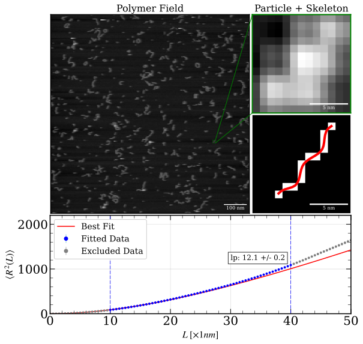

# PsPolypy
Polymer Analysis and Persistence calculation in python

## Table of Contents
- [Installation](#installation)
    - [Dependencies](#dependencies)
    - [Installation Walktrhough](#installation-walkthrough)
- [Usage](#usage)
- [License](#license)
- [Contact](#contact)

## Installation
Please see the following sections outlining the dependencies and installation instructions to install PsPolypy. It is highly reccomended to use virtual environments to manage your installation. Furthermore, an anaconda compatible ```environment.yml``` file is included to simplify creating the environment. Installing Miniconda is outlined [here](https://docs.anaconda.com/miniconda/install/).

### Dependencies
The dependencies for installing PsPolypy is shown below.

- **python 3.12.8**
- **numpy**
- **scipy**
- **scikit-image**
- **matplotlib**
- **jupyter**
- **pillow**
- **networkx**
- **nbstripout**
- **skan**
- **lmfit**
- **igor2**

### Installation Walkthrough
Clone the repository. Either download the code as a .zip and unzip the contents, or run the following in your terminal:
```bash
git clone https://github.com/KingGavinM/PsPolypy.git
```

Create the conda environment by navigating to the `src/` directory in your terminal and running one of the following:
```bash
# If you wish to use the default environment name
conda env create -f PsPolypy.yml
```
```bash
# If you want to use a custom environment name
conda env create -f PsPolypy.yml -n your_environment_name
```

Activate the conda environment by running either:
```bash
# If using the default environment name
conda activate PsPolypy
```
```bash
# Or, if you created a custom environment name
conda activate your_environment_name
```

Install PsPolypy by running:
```bash
pip install .
```

Confirm installation of PsPolypy with the following:
```bash
conda list PsPolypy
```

Which should return something that looks like
```bash
# packages in environment at /path/to/your/miniconda3/envs/your_environment_name:
#
# Name                    Version                   Build  Channel
pspolypy                  x.y.z                    pypi_0     pypi
```

If the previous test succeeded, you are now ready to use PsPolypy!

## Usage
PsPolypy is a package for the automated detection, classification, and persistence length calculation of polymers. For an interactive tutorial see ```tutorial/PsPolypy-Tutorial.ipynb```.

## Citation

If you use *PsPolypy* in academic work, please cite:

Elizabeth A. Conley, Creighton M. Lisowski, Katherine G. Schaefer, Harrison C. Davison, Julie Baguio, Ioan Kosztin,Gavin M. King (2025). *PS Poly: A chain tracing algorithm to determine persistence length and categorize complex polymers by shape.* 
bioRxiv. https://doi.org/10.1101/2024.05.06.592664

## License
PsPolypy - Polymer Analysis and Persistence calculation in python

Copyright (C) 2024  Creighton M. Lisowski & Harrison C. Davison

This program is free software: you can redistribute it and/or modify it under the terms of the GNU General Public License as published by the Free Software Foundation, either version 3 of the License, or (at your option) any later version.

This program is distributed in the hope that it will be useful, but WITHOUT ANY WARRANTY; without even the implied warranty of MERCHANTABILITY or FITNESS FOR A PARTICULAR PURPOSE.  See the GNU General Public License for more details.

You should have received a copy of the GNU General Public License along with this program.  If not, see <https://www.gnu.org/licenses/>.

## Contact
For questions, feedback, or contributions, feel free to reach out:

**Creighton M. Lisowski**

Email: CLisowski@missouri.edu